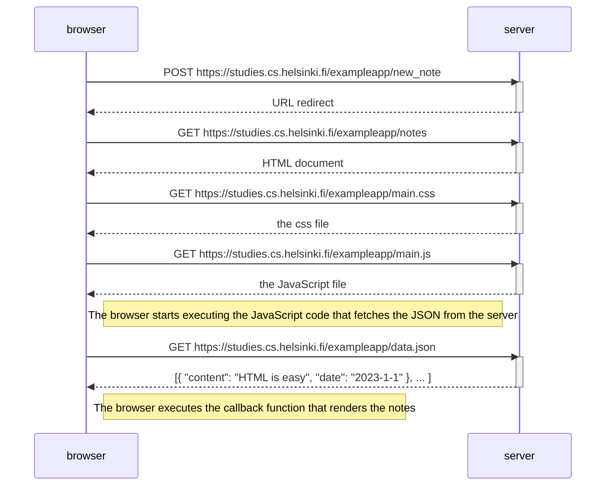
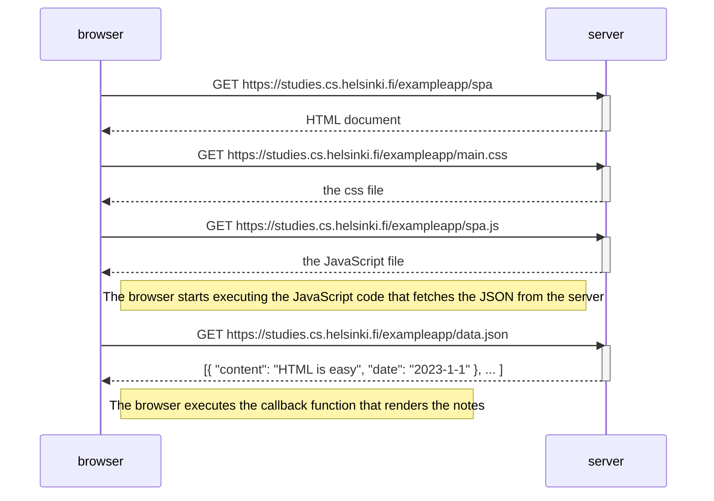
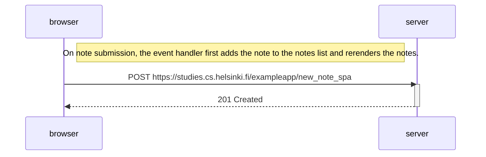

## Exercise 0.4 - New Notes diagram

After submitting a new note, the browser will redirect to the notes page. Which will cause the three additional requests for fetchint the CSS, JavaScript and JSON data.

## Exercise 0.5 - Single Page App diagram
 
Listing all notes in the Single Page App does not differ from the previous example.

## Exercise 0.6 - New note in Single Page App diagram

In the Single Page App, the new note is added to the notes list and the notes are rerendered without a page reload.

